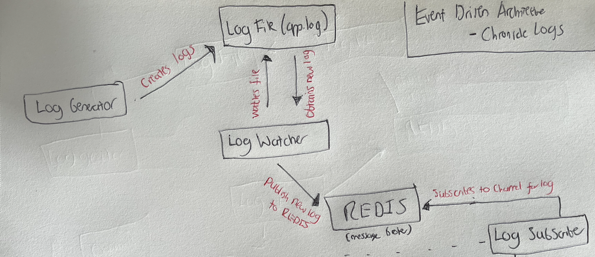

# 🚀 SECTION 1 

## 🌟 Event Driven Architecture  

still to add text here regarding this - will update soon. for now here's some info taken from online:

# Advantages 
## 1. Improved Scalability and Performance

Event-driven architectures significantly enhance scalability and performance when sending logs to Chronicle. Here's why:

Decoupling: By introducing a message queue (like Google Pub/Sub or Kafka) between log sources and Chronicle, you decouple the log generation from log ingestion. This means that if Chronicle's API experiences slowdowns or outages, your log sources can continue to send data without interruption.
Buffering: The message queue acts as a buffer, absorbing spikes in log volume. During high-traffic periods or security incidents when log volume may suddenly increase, the queue can handle the influx without overwhelming Chronicle's API or risking data loss.
Parallel Processing: Event-driven systems allow for multiple consumers to process logs in parallel. This means you can scale out your log processing and sending capabilities horizontally, potentially increasing your overall throughput to Chronicle's API.

## 2. Enhanced Reliability and Data Integrity

An event-driven approach significantly improves the reliability of your log ingestion process:

Guaranteed Delivery: Most event streaming platforms offer at-least-once delivery guarantees. This means that even if there's a network issue or Chronicle's API is temporarily unavailable, logs will be retried and eventually delivered.
Message Persistence: Event streaming platforms typically persist messages for a configurable period. This creates a safety net - if there's an issue with Chronicle ingestion, you have time to resolve it without losing data.
Ordered Processing: Many event-driven systems maintain message order within partitions. This can be crucial for accurate event sequencing in security analysis.

## 3. Flexible Data Transformation and Enrichment

An event-driven architecture provides a powerful framework for log transformation and enrichment:

In-flight Processing: You can introduce stream processing jobs between your queue and Chronicle. This allows for real-time log enrichment, filtering, or normalization before data reaches Chronicle.
Dynamic Routing: Based on log content or metadata, you can dynamically route logs to different Chronicle log types or even to multiple destinations beyond Chronicle (e.g., data lakes, other SIEMs) without putting additional load on your log sources.
Format Conversion: If log sources produce data in formats not directly compatible with Chronicle's UDM (Unified Data Model), you can transform them in-flight, ensuring smooth ingestion.

## 4. Improved Observability and Debugging

Event-driven architectures enhance your ability to monitor and troubleshoot your log pipeline:

Metrics and Monitoring: Event streaming platforms provide detailed metrics on message rates, lag, and processing times. This gives you visibility into your entire log pipeline, not just the final ingestion step.
Replay Capability: If you encounter issues with log processing or ingestion, many event-driven systems allow you to replay messages. This is invaluable for debugging or recovering from data processing errors.
Audit Trail: The message queue creates a clear audit trail of all logs, which can be crucial for compliance and forensic analysis.

## 5. Future-Proofing and Flexibility

Adopting an event-driven architecture provides significant long-term benefits:

Easier Integration: If you need to integrate new log sources or send logs to additional systems beyond Chronicle, an event-driven architecture makes this much simpler. You can add new producers or consumers without modifying existing components.
Technology Evolution: If you decide to switch SIEMs or add additional security tools in the future, an event-driven architecture makes this transition much smoother. You can change downstream consumers without affecting log producers.
Batch and Stream Processing: An event-driven architecture allows you to easily implement both real-time (stream) and batch processing on your log data, providing flexibility in how you analyze and ingest your security data.

#basic diagram  for our project

