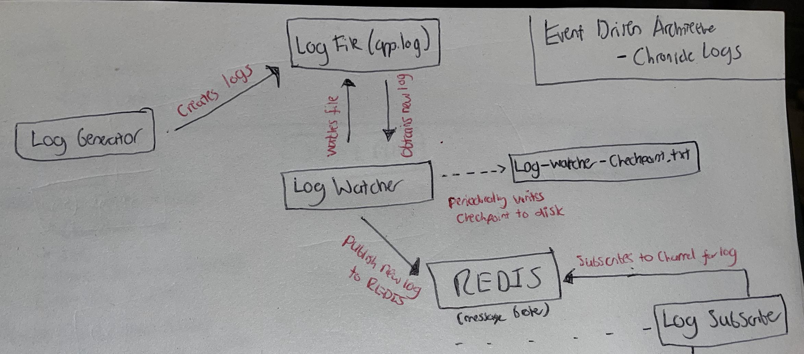

# Section 2 - REDIS Log Gathering System

In this section, I'll cover how to:

- Create a workflow which mimics a real log file
- Set up an event-driven pub/sub architecture with REDIS
- Develop a script to watch our log file for new logs
- Publish new logs to our event broker
- Subscribe to our event broker to get the logs

## Architecture



## Repo Overview

There are 4 main components inside this section. Let's discuss them one by one.

### 1. Log-Generator.py

I created a Python script which mimics real log generation for an application.

This script uses a list of sample log types e.g. INFO, WARNING, ERROR and a list of sample log messages.

Random values are chosen from both these lists and are combined with the timestamp to create a JSON log.

New JSON logs are appended to the file at the specified interval at the following method in main():
```
time.sleep()
```
### 2. Log-Watcher.py

The log-watcher.py leverages the Python watchdog library to watch the log file previously created for any changes.

It checks for changes at the interval specified in main().

If it finds a new log entry, which it has not already processed, it publishes it to a REDIS channel.

### 3. REDIS

I implemented Redis as the message broker to decouple log collection from processing.

Why Redis:
- High performance for high-volume data handling
- Built-in pub/sub functionality
- Easy to set up and use, perfect for this demonstration

In a production Chronicle environment, it might use a more robust solution like Apache Kafka or Google Cloud Pub/Sub, but for this local example Redis illustrates the concept of event-driven architecture well and has minimal overhead.

``` 
Remember to start the redis-server before running the code.

```
### 4. Log-Subscriber.py

This Python script was created to subscribe to the REDIS channel, allowing us to obtain the logs from the event broker.

An empty parse_log function has been provided here which just outputs the log to the terminal. In later sections we will use this for parsing our logs into a UDM format.

### 5. Checkpoint.py

A problem was identified that if the log subscriber failed and had to be restarted, it would re-write the entire contents of the app.log file to the event broker.

A log-watcher-checkpoint was created to add some fault tolerance to our system. The additional script functions by holding the number of bytes read in the file in memory and after X number of writes or Y amount of time it writes this to disk.

Advantages:

- Avoids duplicate logs from being sent to the subscriber
- Ensures that once the log-watcher is back online, all unprocessed logs are published to the event broker.

## Run the code

Once all three files (log-generator, log_watcher and log_subscriber) are running, logs which are created by the generator should appear instantaneously within the subscriber window.