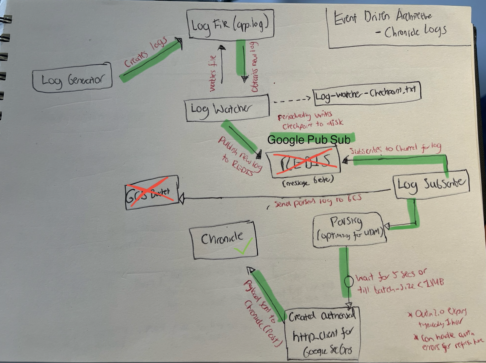

# 🚀 SECTION 5 - Google Pub/Sub Log Gathering System with Injestion API 

For this section, we'll cover how to send data obtained from Google Pub/Sub to Chronicle via the Ingestion API.

## Ingestion API Info 

- All of Chronicle's REST APIs use OAuth 2.0 for authentication.
- Service account JSON credential provided by Google SecOps Partner.
- Authenticate with the Google Malachite-ingestion endpoint first for your http_client, then it will create an authorized http_client object upon success.

### Ingestion API has 4 endpoints

- udmEvents
- unstructuredlogentries
- createentities (for pre-formatted UDM → which removes all reliance on parsing process)
- logtypes (returns list of valid log types)

### Types of Requests with the Ingestion API

- Can do GET request to obtain data from the API endpoint, e.g., what log types it supports receiving.
- Can do PUT request to send data to the API endpoint, e.g., logs for ingestion.

### Sending Unstructured logs to Chronicle

- Unstructured log entries, e.g., syslogs or JSON from an application.

These logs should be present in the correct format for the API endpoint to understand it → wrap it in the correct request body.

- **Body** should be tagged with a logType, so the endpoint understands how to parse the data when it gets received.
- **customer_id** is the key to separate data from different customers and ensure it goes to your instance.
- **Entries** is the log entries with the format beginning with `{"LogText": "entry1KeyValuePair", LogText: "entry2keyvaluepair"}`.

Max Message size is 1MB, so when sending large amounts of messages, you have to be aware of the payload (log entries) and set up batching accordingly.


## Architecture 

Slightly messy but I hope you get the idea. Will transform to draw.io diagram soon.




## Code for Ingestion API Subscriber

We have provided the code below to authenticate with the Ingestion API and incorporate it within our log-subscriber.py file. This will not be run due to not having access to a test Chronicle instance, but it has been provided to show how the Ingestion API should be configured to work with a Google Pub/Sub subscriber.

### Code Changes

Update the imports to access the ingestion API:

```python
from google.cloud import pubsub_v1
from google.oauth2 import service_account
from google.auth.transport.requests import AuthorizedSession
```

### Authorizing with the Ingestion API

You should set the following variables in your file:

```python
SCOPES = ['https://www.googleapis.com/auth/malachite-ingestion'] # OAuth2.0 scope
ING_SERVICE_ACCOUNT_FILE = '/path/to/your/service-account-key.json' # JSON key obtained from your Chronicle Google Rep 
CHRONICLE_INGESTION_URL = 'https://malachiteingestion-pa.googleapis.com/v2/projects/YOUR_PROJECT_ID/locations/YOUR_LOCATION/lake:batchCreateLogs' # your custom ingestion URL to your Chronicle instance
```

This function then loads the service account credentials from the file to create an authorized session to handle API requests:

```python
def create_authorized_session():
    credentials = service_account.Credentials.from_service_account_file(
        ING_SERVICE_ACCOUNT_FILE, 
        scopes=SCOPES
    )
    return AuthorizedSession(credentials)
```

As mentioned above, we must structure the log being sent to Chronicle in the appropriate format. 

The log_type chosen here will ensure it is being parsed by Chronicle parsers properly, so please select one carefully from the list here... [Google Cloud Chronicle Ingestion API Documentation](https://cloud.google.com/chronicle/docs/reference/ingestion-api)


```python
def send_to_chronicle(session, log_entry):
    body = {
        "customer_id": "YOUR_CUSTOMER_ID",
        "log_type": "YOUR_LOG_TYPE",
        "entries": [log_entry]
    }
    
    try:
        response = session.post(CHRONICLE_INGESTION_URL, json=body)
        response.raise_for_status()
        print(f"Successfully sent log to Chronicle: {log_entry}")
    except requests.exceptions.RequestException as e:
        print(f"Failed to send log to Chronicle. Error: {e}")
```

This function:
- Prepares the request body with your customer ID, log type, and the log entry.
- Sends a POST request to the Chronicle ingestion URL.
- Checks for any HTTP errors using raise_for_status().
- Prints a success message if the request was successful, or an error message if it failed.

Error handling is also added to ensure that messages are processed properly:

```python
except json.JSONDecodeError as e:
    print(f"Error decoding message: {e}")
    message.nack()
except Exception as e:
    print(f"Error processing message: {e}")
    message.nack()
```